# F1 Data Analysis

[](https://github.com/JanikSchala/f1-data-analysis/actions/workflows/tests.yml)
[](https://github.com/JanikSchala/f1-data-analysis/actions/workflows/f1analyze-ci.yml)
[](pyproject.toml)
[](LICENSE)

Analyse von Formel-1-Renndaten mit [FastF1](https://github.com/theOehrly/Fast-F1) —
Timing, Telemetrie, Reifenstrategie, Machine Learning und Data Engineering.

Ein Nebenprojekt neben dem Studium, aus Interesse an dem, was hinter den
Rundenzeiten steckt.

Die Bibliothek liefert Rohdaten aus dem offiziellen Live-Timing-Feed: Rundenzeiten,
Sektorzeiten, Positionsdaten im Zehntelsekundentakt, Telemetriekanäle für Speed,
Gas, Bremse, Gang und DRS. Was daraus wird, hängt davon ab, wie man sie behandelt.
Hier stehen **45 eigenständige Analysen über zwölf Themenfelder**, jede mit
lauffähigem Code und dokumentiertem Vorgehen.

```bash
git clone https://github.com/JanikSchala/f1-data-analysis.git
cd f1-data-analysis
./setup.sh
source .venv/bin/activate
python 01_grundlagen/p01_session_explorer_jede_session_der_f1_historie_la.py
```

---

## Inhalt

- [Projektübersicht](#projektübersicht)
- [Was drinsteckt](#was-drinsteckt)
  - [Telemetrie auf Streckenebene](#telemetrie-auf-streckenebene)
  - [Fahrervergleich mit Zeitdelta](#fahrervergleich-mit-zeitdelta)
  - [Race Pace, sauber gerechnet](#race-pace-sauber-gerechnet)
  - [Reifenstrategie](#reifenstrategie)
  - [Degradation quantifiziert](#degradation-quantifiziert)
  - [Der Undercut gewinnt seltener, als man denkt](#der-undercut-gewinnt-seltener-als-man-denkt)
  - [Safety Car staucht das Feld zusammen](#safety-car-staucht-das-feld-zusammen)
  - [Eine Rundenzeit aus reiner Physik](#eine-rundenzeit-aus-reiner-physik)
  - [75 Jahre F1: dieselbe Strecke ist selten dieselbe Strecke](#75-jahre-f1-dieselbe-strecke-ist-selten-dieselbe-strecke)
  - [Streckengeometrie einer ganzen Saison](#streckengeometrie-einer-ganzen-saison)
  - [Streckentemperatur kostet echte Zehntel — aber erst nach der Bereinigung](#streckentemperatur-kostet-echte-zehntel--aber-erst-nach-der-bereinigung)
  - [Fahrstil-Clustering: fährt jeder anders?](#fahrstil-clustering-fährt-jeder-anders)
  - [Eine Saison-Rangliste, direkt aus dem Data Warehouse](#eine-saison-rangliste-direkt-aus-dem-data-warehouse)
  - [Positionsverlauf, wie ihn auch der automatische Rennbericht zeigt](#positionsverlauf-wie-ihn-auch-der-automatische-rennbericht-zeigt)
  - [Ein Live-Feed, den es gerade nicht gibt](#ein-live-feed-den-es-gerade-nicht-gibt)
  - [Wer gewinnt die Konstrukteurs-WM?](#wer-gewinnt-die-konstrukteurs-wm)
- [`f1lab` — die wiederverwendbaren Teile](#f1lab--die-wiederverwendbaren-teile)
- [Aufbau](#aufbau)
- [Methodische Entscheidungen](#methodische-entscheidungen)
- [Grenzen](#grenzen)
- [Setup](#setup)
- [Projektindex](#projektindex)
- [Reproduzieren](#reproduzieren)
- [Weiterführende Ressourcen](#weiterführende-ressourcen)
- [Hinweis](#hinweis)

---

## Projektübersicht

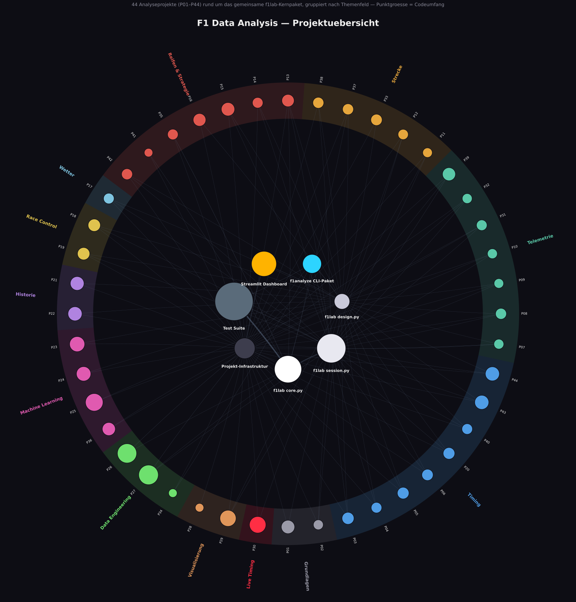

Alle 44 Analysen (P01–P44), nach Themenfeld gruppiert, rund um das gemeinsame
`f1lab`-Kernpaket und die Dashboard-/CLI-/Test-Infrastruktur. Punktgröße zeigt
den Codeumfang, die feinen Linien zur Mitte zeigen, welche Projekte welche
Teile von `f1lab` tatsächlich nutzen. Erzeugt aus einem Knowledge Graph über
den gesamten Code (via [graphify](https://github.com/safishamsi/graphify)) —
kein von Hand gepflegtes Diagramm, sondern eine echte Auswertung der
Importe und Aufrufe im Repository.

---

## Was drinsteckt

### Telemetrie auf Streckenebene

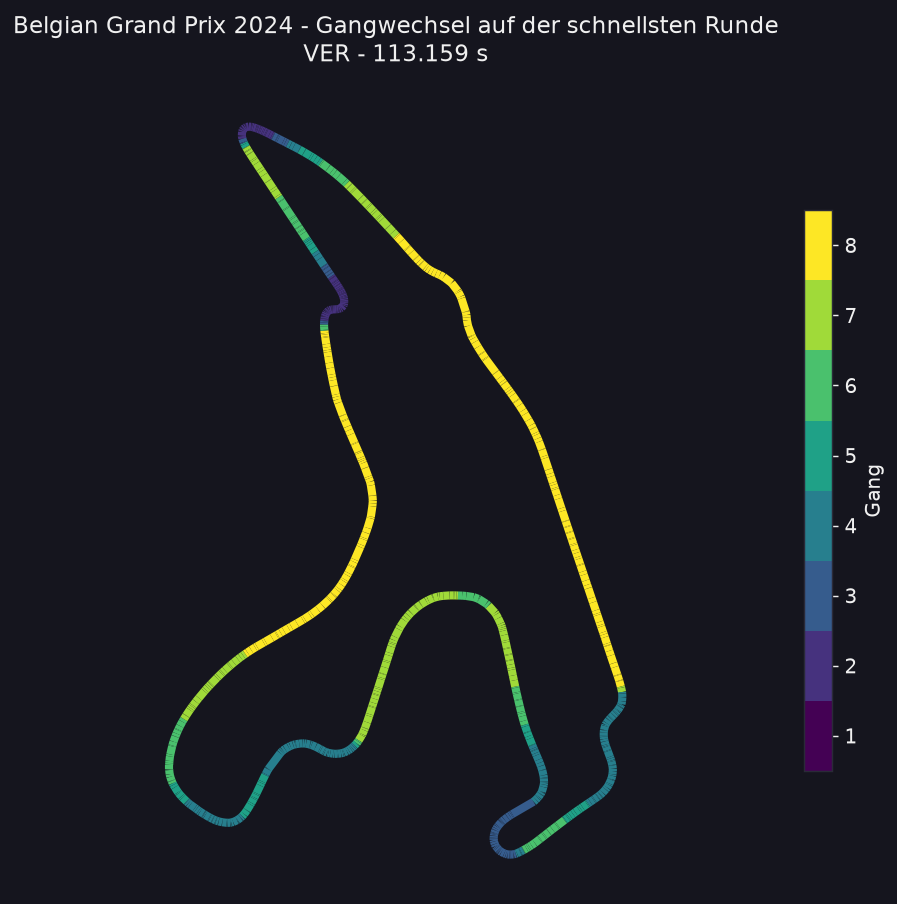

Positionsdaten (X/Y) und Telemetrie werden über den Zeitstempel zusammengeführt und
als `LineCollection` eingefärbt. Verstappens schnellste Runde in Spa 2024:
**1:53.159** über **6963 m**, aufgelöst in 844 Messpunkte. Man sieht die
Kemmel-Gerade im achten Gang ebenso wie die Bus-Stop-Schikane im zweiten.

*Code: [`03_telemetrie/p09_gangwechsel_karte_der_strecke.py`](03_telemetrie/p09_gangwechsel_karte_der_strecke.py)*

---

### Fahrervergleich mit Zeitdelta

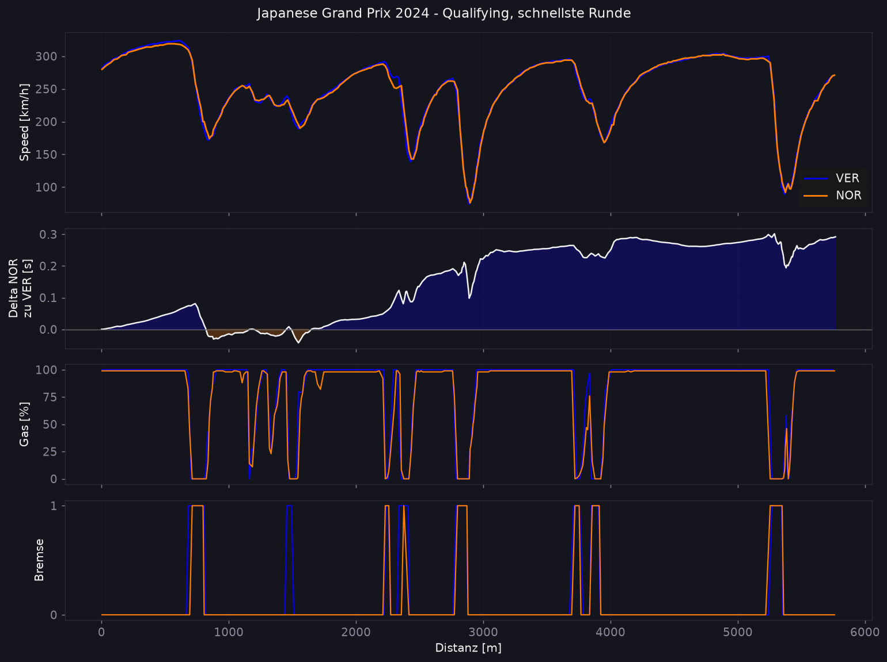

Verstappen gegen Norris im Qualifying von Suzuka 2024, **0.292 s** Unterschied auf
der Runde. Das kumulierte Delta zeigt, *wo* die Zeit entsteht: Norris liegt zwischen
Meter 800 und 1600 leicht vorn, verliert dann ab Meter 1700 kontinuierlich. Bei
Höchstgeschwindigkeit trennen die beiden 5 km/h (324 zu 319).

Berechnet mit `fastf1.utils.delta_time()`, das beide Runden über die zurückgelegte
Distanz interpoliert — nötig, weil die Telemetrie nicht synchron abgetastet wird.

*Code: [`03_telemetrie/p07_telemetrie_overlay_zwei_schnellste_runden_uebere.py`](03_telemetrie/p07_telemetrie_overlay_zwei_schnellste_runden_uebere.py)*

---

### Race Pace, sauber gerechnet

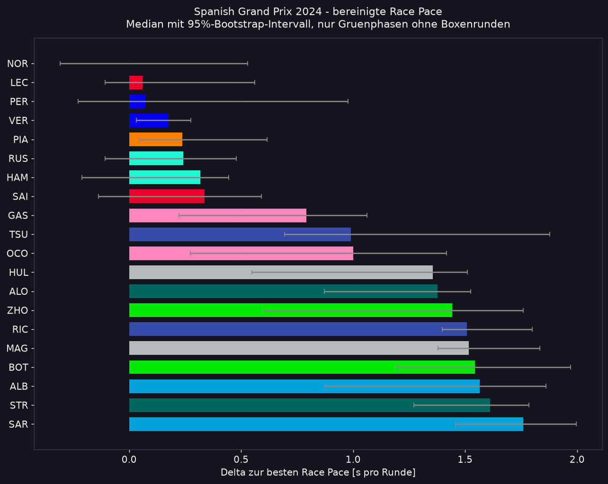

Die naive Auswertung aller Rundenzeiten ist wertlos: Out-Laps, In-Laps,
Safety-Car-Phasen und gestrichene Runden verzerren jede Verteilung. Nach dem Filter
auf grüne Flagge, ohne Boxenrunden, ohne Ausreißer über 107 % bleiben in Barcelona
2024 noch **1124 von 1310 Runden** übrig — 14 % fliegen raus.

Auch danach fehlt noch die Treibstoffkorrektur (0.03 s/Runde/kg, ca. 100 kg über die
Renndistanz) — ohne sie hängt der Median zusätzlich davon ab, *wann* im Rennen die
sauberen Runden eines Fahrers liegen. Erst korrigiert lässt sich fair rechnen: Norris
war der Schnellste, Verstappen lag **0.002 s** dahinter, Russell **0.239 s**,
Leclerc **0.273 s**, Hamilton **0.282 s**.

Und genau hier wird es interessant: Die Balken tragen ein Bootstrap-Konfidenzintervall
über 1000 Resamples, und das von Norris reicht bis 0.252 s. Sieben Fahrer — bis
Sainz auf Platz 7 — liegen mit ihrem unteren Intervallrand innerhalb davon. Die
ehrliche Aussage lautet deshalb nicht „Norris war schneller als die anderen sechs",
sondern: **diese sieben sind mit diesen Daten nicht unterscheidbar.** Erst Pérez auf
Platz 8 (0.524 s) ist mit seinem Intervall eindeutig abgesetzt.

`Interval.overlaps()` macht diesen Vergleich explizit, statt ihn dem Auge zu
überlassen.

*Code: [`02_timing/p04_race_pace_ranking_wer_war_wirklich_am_schnellste.py`](02_timing/p04_race_pace_ranking_wer_war_wirklich_am_schnellste.py)*

---

### Reifenstrategie

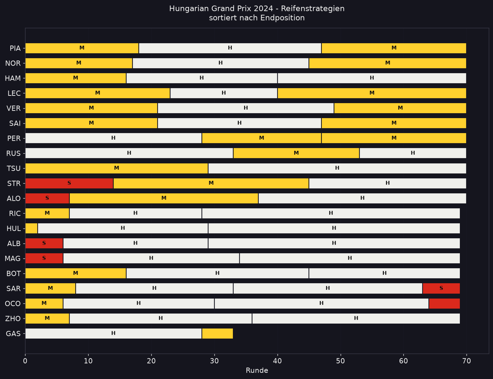

Ungarn 2024, sortiert nach Endposition. Das Spitzenfeld fuhr überwiegend
Medium–Hard–Medium, das Mittelfeld setzte auf Hard–Hard. Im Schnitt 3 Stints pro
Fahrer, mittlere Stintlänge 29 Runden auf Hard gegenüber 7 Runden auf Soft.

*Code: [`05_reifen_strategie/p14_stint_und_strategie_uebersicht_als_gantt_chart.py`](05_reifen_strategie/p14_stint_und_strategie_uebersicht_als_gantt_chart.py)*

---

### Degradation quantifiziert

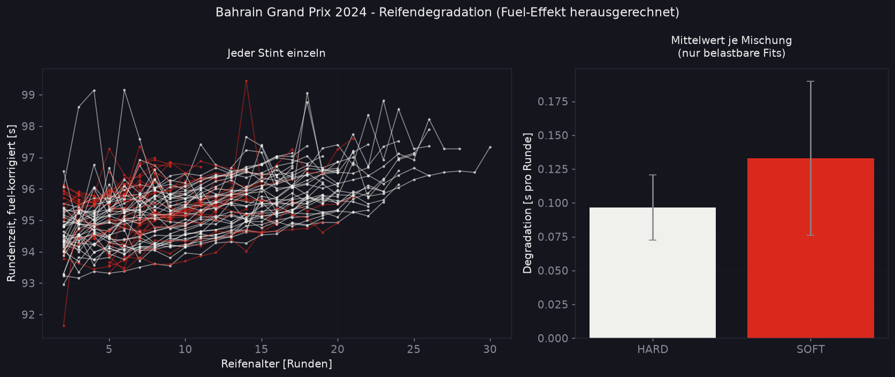

Rundenzeiten steigen im Stint aus zwei Gründen: der Reifen baut ab, aber das Auto
wird gleichzeitig leichter. Wer beides nicht trennt, unterschätzt die Degradation
systematisch. Hier ist der Treibstoffeffekt herausgerechnet (1.8 kg pro Runde,
0.03 s pro kg), danach wird je Stint eine Regression über das Reifenalter gelegt.

Bahrain 2024, **59 von 62 Stints** bestehen die Plausibilitätsprüfung (mindestens
6 Runden, R² ≥ 0.3): **Soft 0.133 s/Runde**, **Hard 0.097 s/Runde**. Der Soft baut
also gut ein Drittel schneller ab.

Die Streuung ist dabei aufschlussreicher als der Mittelwert: beim Hard liegt sie bei
0.024, beim Soft bei 0.057 s/Runde. Der weiche Reifen reagiert also deutlich
empfindlicher auf Fahrstil und Fahrzeugbalance — was erklärt, warum manche Fahrer
mit derselben Mischung ganz andere Stintlängen hinbekommen als andere.

*Code: [`05_reifen_strategie/p13_reifendegradation_modellieren.py`](05_reifen_strategie/p13_reifendegradation_modellieren.py)*

---

### Der Undercut gewinnt seltener, als man denkt

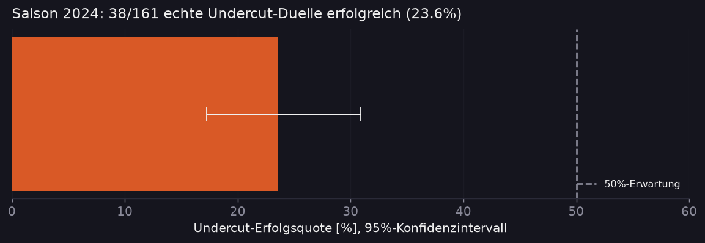

Die verbreitete Intuition: früher an die Box gehen, auf frischen Reifen einen
Freiflug fahren und den Rivalen so überholen, bevor der überhaupt gestoppt hat.
Gemessen an echten, paarweisen Duellen (Boxenstopp gegen den einen Fahrer, der
zu Rundenbeginn direkt davor lag) sieht das anders aus.

Saison 2024, alle 24 Rennen: **161 echte Undercut-Duelle, nur 38 erfolgreich —
23.6 % Erfolgsquote** (95 %-Konfidenzintervall 17.3–30.9 %, statistisch klar
verschieden von 50/50). Die Verteidigung gewinnt in diesen Daten gut drei von
vier direkten Duellen.

*Code: [`05_reifen_strategie/p42_undercut_erfolgsquote_echte_rivalen_duelle.py`](05_reifen_strategie/p42_undercut_erfolgsquote_echte_rivalen_duelle.py)*

---

### Safety Car staucht das Feld zusammen

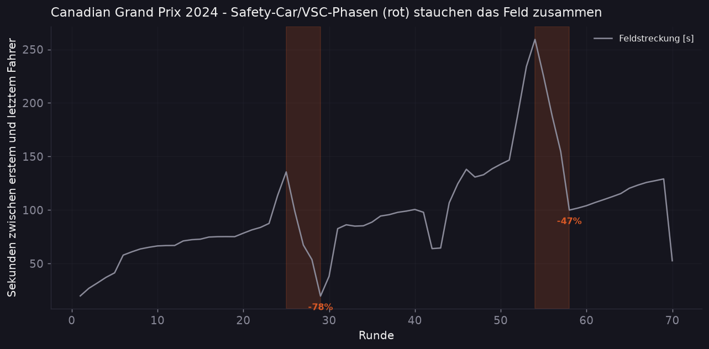

Wie stark neutralisiert eine Safety-Car- oder VSC-Phase tatsächlich das Feld?
Gemessen als Sekunden zwischen erstem und letztem Fahrer auf derselben Runde,
Baseline aus den letzten drei grünen Runden davor gegen das Minimum während
der Phase.

Kanada 2024, zwei Neutralisationen: Runde 25–29 komprimiert das Feld von
87.5 s auf 19.7 s (**−77.5 %**), Runde 54–58 von 189.5 s auf 100.0 s
(**−47.3 %**) — je nachdem, wie zerstreut das Feld beim Auslösen gerade war.

*Code: [`07_race_control/p18_safety_car_und_track_status_chronik.py`](07_race_control/p18_safety_car_und_track_status_chronik.py)*

---

### Eine Rundenzeit aus reiner Physik

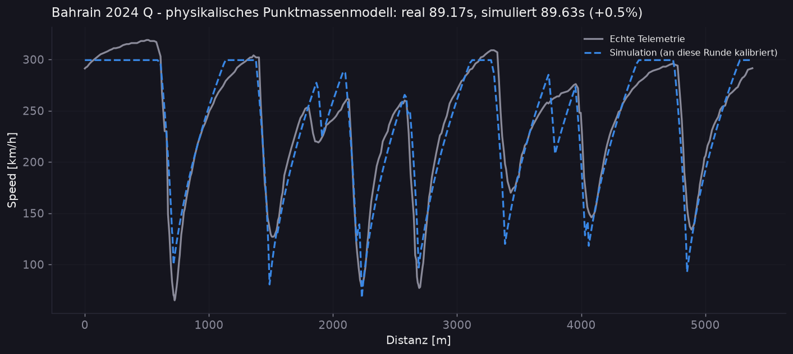

Kein Nachschlagen echter Rundenzeiten: ein quasi-stationäres Punktmassenmodell
(dasselbe Grundverfahren wie OptimumLap und ähnliche Rundenzeit-Simulatoren)
rechnet aus Streckenkrümmung und vier Fahrzeugparametern eine Runde komplett
selbst aus. Die Krümmung kommt aus der echten Ideallinie, die vier Parameter
(Kurvengrenzbeschleunigung, Längsbeschleunigung, Bremsverzögerung,
Höchstgeschwindigkeit) werden per kleinste Quadrate an die echte
Geschwindigkeitsspur einer Referenzrunde kalibriert — nicht von Hand geraten.

Bahrain 2024 Qualifying: Simulation trifft die echte Rundenzeit auf
**0.52 % genau** (89.63 s simuliert gegen 89.165 s real), mit plausiblen
Parametern (2.62 g Kurvengrenze, ~3.0 g Bremsverzögerung, 299 km/h
Höchstgeschwindigkeit).

*Code: [`04_strecke/p37_rundenzeit_simulation_punktmassenmodell.py`](04_strecke/p37_rundenzeit_simulation_punktmassenmodell.py)*

---

### 75 Jahre F1: dieselbe Strecke ist selten dieselbe Strecke

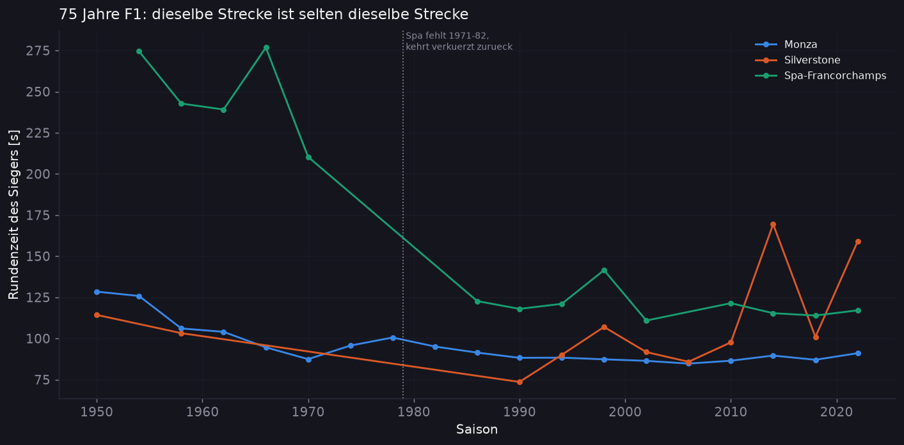

Rundenzeit des Siegers auf drei Strecken, die seit Jahrzehnten im Kalender
stehen — die naheliegende Annahme "Strecke unverändert, also nur die Autos
schneller" hält nicht durch. Silverstone wird über 75 Jahre **langsamer**
(114.3 s → 159.0 s, 1950 vs. 2022): die Strecke ist seither deutlich länger
geworden. Spa (274.5 s → 117.1 s) fehlt 1971–82 komplett aus dem Kalender und
kehrt 1983 in stark verkürzter Form zurück. Nur Monza (128.5 s → 91.1 s)
zeigt ungefähr das erwartete Bild reinen Fortschritts.

*Code: [`08_historie/p22_75_jahre_f1_historische_trendanalyse.py`](08_historie/p22_75_jahre_f1_historische_trendanalyse.py)*

---

### Streckengeometrie einer ganzen Saison

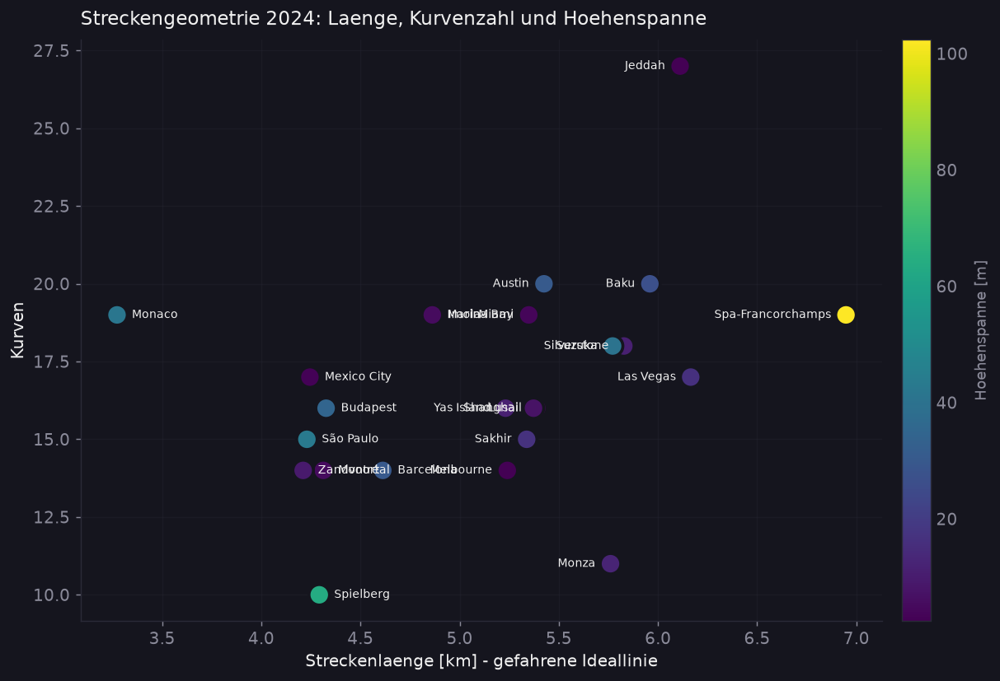

Länge, Kurvenzahl und Höhenspanne aller 24 Strecken der Saison 2024 in einem
Blick — automatisch aus der echten GPS-Ideallinie jeder Strecke vermessen,
nicht aus einer Tabelle abgetippt.

Spa-Francorchamps ist mit Abstand die längste Strecke der Saison und hat mit
**102,4 m** auch die größte Höhenspanne, Monaco die kürzeste.

*Code: [`01_grundlagen/p02_saison_kalender_event_metadaten_als_datenbank.py`](01_grundlagen/p02_saison_kalender_event_metadaten_als_datenbank.py)*

---

### Streckentemperatur kostet echte Zehntel — aber erst nach der Bereinigung

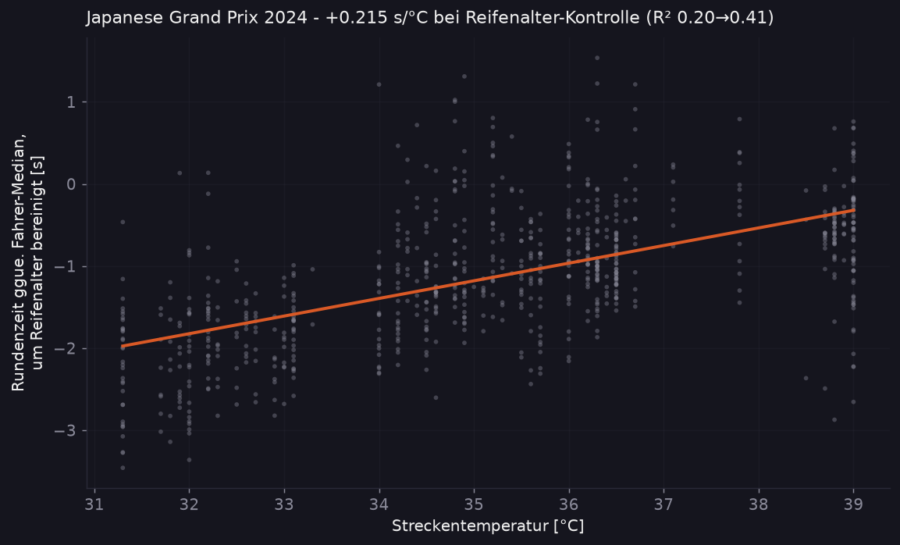

Eine naive, gepoolte Regression von Rundenzeit gegen Streckentemperatur
findet praktisch nichts (R² = 0,028) — Fahrerunterschiede und Reifenalter
überdecken den Effekt komplett. Erst nach Bereinigung um Fahrer-Median und
Reifenalter wird er sichtbar.

Japan 2024: R² springt von 0,199 (nur Reifenalter) auf **0,413** (+
Temperatur), Koeffizient **+0,215 s pro °C**.

*Code: [`06_wetter/p17_wetter_impact_wie_regen_und_streckentemperatur_d.py`](06_wetter/p17_wetter_impact_wie_regen_und_streckentemperatur_d.py)*

---

### Fahrstil-Clustering: fährt jeder anders?

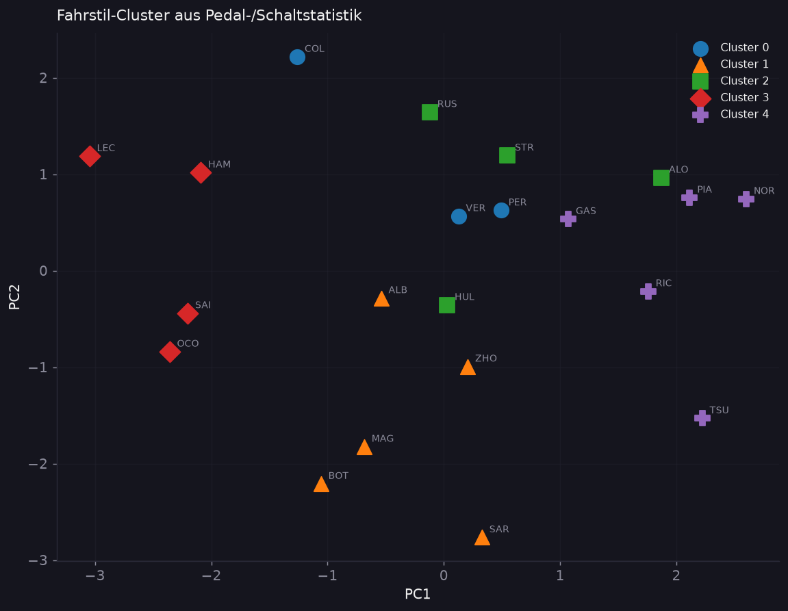

Aus reiner Pedal-/Schaltstatistik (Vollgasanteil, Bremsanteil, Rollphasen,
Throttle-Modulation, Überlappung von Gas und Bremse) über vier Strecken der
Saison 2024 gruppiert k-Means 21 Fahrer in Cluster — der Silhouette Score
wählt die Anzahl, statt sie anzunehmen.

Gewählt wird **k = 5**, der Score bleibt dabei mit 0,236 aber moderat: die
Fahrstile trennen sich sichtbar, aber nicht scharf.

*Code: [`09_machine_learning/p24_fahrstil_clustering_wer_faehrt_wie.py`](09_machine_learning/p24_fahrstil_clustering_wer_faehrt_wie.py)*

---

### Eine Saison-Rangliste, direkt aus dem Data Warehouse

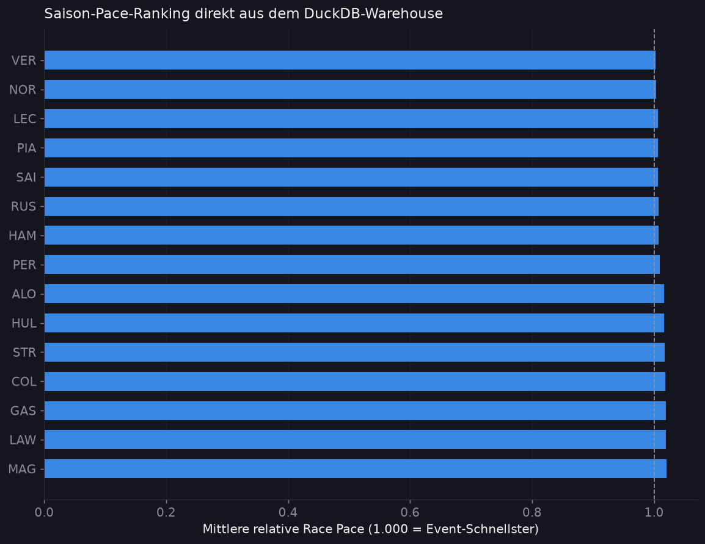

Keine neue Berechnung — eine einzige SQL-Abfrage gegen das DuckDB-Sternschema
(`fact_lap`, `dim_driver`, `dim_event`, …), das aus 24 geladenen Rennen der
Saison 2024 aufgebaut wird.

Mittlere relative Race Pace über die ganze Saison (1,000 = jeweils
Event-Schnellster): **Verstappen führt mit 1,0027**, knapp vor Norris
(1,0030) und Leclerc (1,0062).

*Code: [`10_data_engineering/p26_f1_data_warehouse_sternschema_in_duckdb.py`](10_data_engineering/p26_f1_data_warehouse_sternschema_in_duckdb.py)*

---

### Positionsverlauf, wie ihn auch der automatische Rennbericht zeigt

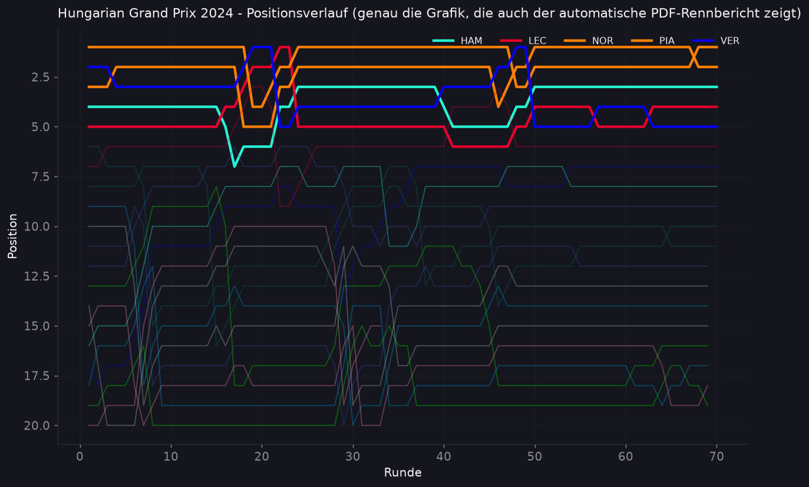

Runde für Runde, wer wo im Feld liegt — exakt die Funktion, die auch der
automatisch generierte PDF-Rennbericht für jedes Rennen zeichnet, damit
Dashboard, Report und README nie unterschiedliche Bilder derselben Session
zeigen.

Ungarn 2024: Piastri gewinnt vor Norris, das Podium komplettiert Hamilton.

*Code: [`11_visualisierung/p29_automatischer_rennbericht_als_pdf.py`](11_visualisierung/p29_automatischer_rennbericht_als_pdf.py)*

---

### Ein Live-Feed, den es gerade nicht gibt

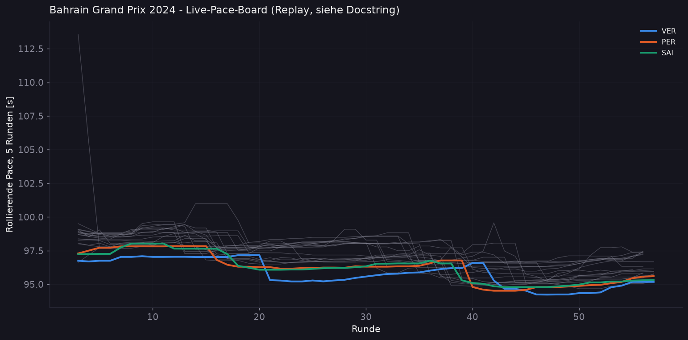

Live-Timing existiert nur, während eine Session tatsächlich läuft. Statt das
zu ignorieren, spielt dieser Code eine echte, bereits abgeschlossene Session
Runde für Runde in ihrer tatsächlichen zeitlichen Reihenfolge in eine
SQLite-Zeitreihe ein — dieselbe Logik, die auch einen echten Feed
verarbeiten würde.

Bahrain 2024: **1.087 Datenpunkte**, rollierende Pace über die komplette
Renndistanz, Podium hervorgehoben.

*Code: [`12_live_timing/p30_live_timing_aufzeichnen_und_in_echtzeit_auswerte.py`](12_live_timing/p30_live_timing_aufzeichnen_und_in_echtzeit_auswerte.py)*

---

### Wer gewinnt die Konstrukteurs-WM?

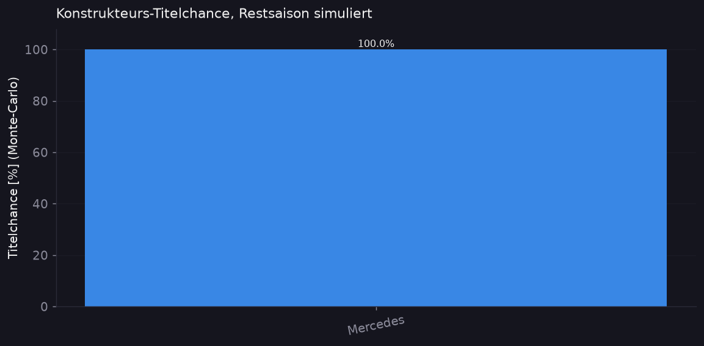

Dieselbe Monte-Carlo-Mechanik wie beim Fahrer-WM-Simulator (P21), aber auf
Teamebene: pro verbleibendem Event werden zwei unabhängige Positionen je
Konstrukteur gezogen, nicht eine — ein Team bringt zwei Autos an den Start,
beide Punkte zählen. Läuft auf der echten, laufenden Saison.

Aktueller Stand: **Mercedes führt mit 425 Punkten** vor Ferrari (338) und
McLaren (263) — die Simulation der Restsaison gibt Mercedes eine
**Titelchance von 99,8 %**, für Ferrari bleiben 0,2 %, der Rest praktisch
nichts.

*Code: [`08_historie/p45_konstrukteurs_wm_simulator_wer_gewinnt_das_team.py`](08_historie/p45_konstrukteurs_wm_simulator_wer_gewinnt_das_team.py)*

---

## `f1lab` — die wiederverwendbaren Teile

Die 45 Skripte zeigen jeweils eine Analyse. Was mehrfach gebraucht wird, liegt als
installierbares Paket daneben — mit einer bewussten Trennung:

```
f1lab/core.py       reine Rechnung auf numpy-Arrays, ohne Netzzugriff testbar
f1lab/session.py    FastF1-Anbindung: laden, filtern, aggregieren
```

Diese Trennung ist der Grund, warum sich das Ganze überhaupt testen lässt. Wäre die
Degradationsschätzung fest mit `session.laps` verdrahtet, bräuchte jeder Test eine
Internetverbindung und eine geladene Session. So bekommt `fit_degradation()` zwei
Arrays und liefert eine Steigung — prüfbar gegen synthetische Daten mit bekannter
Wahrheit.

```python
import f1lab

ses = f1lab.load(2024, "Spain", "R")
print(f1lab.pace_table(ses).head())
print(f1lab.degradation_by_compound(ses))
print(f"Pitloss: {f1lab.pit_loss(ses):.2f} s")
```

**188 Tests, alle ohne Netzzugriff:**

```bash
pip install pytest
pytest -q
```

Die Tests prüfen nicht, ob der Code läuft, sondern ob er *richtig rechnet*. Ein paar
Beispiele für die Art von Aussage, die dahintersteht:

- Bei konstantem Reifen und reinem Spritverbrauch muss `fuel_correct()` die Zeiten
  vollständig flach ziehen — Standardabweichung null.
- `bootstrap_median()` muss bei einem einzelnen Extremausreißer stabil bleiben.
  Genau deswegen steht dort der Median und nicht der Mittelwert.
- `find_cliff()` darf bei einem linearen Stint *keinen* Knick melden, und einen
  flacher werdenden Verlauf nicht als Cliff durchgehen lassen.
- `braking_zones()` muss eine Bremszone erkennen, die direkt am Anfang des Arrays
  beginnt — die Flankenerkennung über `np.diff` verliert die sonst.

Der letzte Punkt ist kein hypothetisches Beispiel: der Test hat beim ersten Lauf
einen Off-by-one in der Kantenerkennung gefunden. Die Zone endete eine Probe zu
spät, wodurch die Ausgangsgeschwindigkeit gleich der Eingangsgeschwindigkeit war.

Ein zweiter Fund kam aus dem Rauchtest gegen echte Daten: FastF1s
`pick_not_deleted()` invertiert die Spalte `Deleted` direkt mit `~`. Sobald darin
`None` steht — der Normalfall, wenn die Rennleitung zu einer Runde nichts gemeldet
hat — ist die Spalte object-dtype und pandas wirft einen `TypeError`. In Barcelona
2024 stürzt damit jede Pace-Auswertung ab. `f1lab.session.not_deleted_mask()`
behandelt den Fall explizit und ist gegen beide dtype-Varianten getestet.

Die Tests laufen ohne Installation: eine `conftest.py` im Wurzelverzeichnis legt
das Repo auf den Importpfad.

---

## Aufbau

```
f1lab/                installierbares Paket, core (rein) + session (FastF1)
tests/                200 Tests, laufen offline

01_grundlagen/        Datenzugriff, Caching, Kalender als Dimensionstabelle
02_timing/            Rundenzeiten, Pace-Ranking, Sektoren, Positionsverlauf
03_telemetrie/        Speed, Bremspunkte, Gänge, DRS, Starts, Dirty Air
04_strecke/           Streckenkarten, Kurvenprofile, Layout-Vergleich über Jahre
05_reifen_strategie/  Degradation, Stints, Undercut-Simulation, Boxenstopps
06_wetter/            Temperatur- und Regeneffekte auf die Pace
07_race_control/      Safety Car, Strafen, Track Limits
08_historie/          Ergast-API, WM-Simulation, 75 Jahre Trendanalyse
09_machine_learning/  Qualifying-Vorhersage, Fahrstil-Clustering, Anomalien
10_data_engineering/  DuckDB-Warehouse, REST-API, CLI-Paket
11_visualisierung/    Streamlit-Dashboard, automatischer PDF-Rennbericht
12_live_timing/       Echtzeit-Aufzeichnung des Timing-Streams

make_assets.py        erzeugt die Grafiken oben
check_setup.py        prüft Umgebung, Pakete, Cache und API-Zugriff
```

Jedes Skript läuft eigenständig, mit knappen Kommentaren statt eines
ausführlichen Kopf-Docstrings.

---

## Methodische Entscheidungen

Ein paar Dinge, die den Unterschied zwischen einer hübschen Grafik und einer
belastbaren Aussage ausmachen:

**Rundenfilterung.** `pick_track_status("1")` behält nur Runden unter grüner Flagge.
Ohne das mischen sich Safety-Car-Runden in die Verteilung und verschieben den Median
um mehrere Zehntel. Dazu `pick_wo_box()`, `pick_accurate()` und die Behandlung
gestrichener Runden, zusammengefasst in `f1lab.clean_laps()`.

**Treibstoffkorrektur.** Über eine Renndistanz summiert sich der Effekt auf mehrere
Sekunden pro Runde. Die verwendeten 0.03 s/kg sind ein Literaturwert, kein gemessener
— die Größenordnung stimmt, die dritte Nachkommastelle sollte man nicht
überinterpretieren.

**Unsicherheit ausweisen.** Ein Median ohne Streuungsmaß suggeriert Präzision, die
nicht da ist. Deswegen Bootstrap-Intervalle statt nackter Zahlen.

**Zeitliche Validierung beim ML.** Rennen kommen chronologisch. Ein zufälliger
Train-Test-Split würde mit Zukunftswissen trainieren, deshalb `TimeSeriesSplit`.

---

## Grenzen

Die Analysen kontrollieren nicht für Verkehr, Motormodus oder Tankstrategie. Ein
Fahrer, der 20 Runden im Windschatten festhing, sieht langsamer aus, als er war —
Projekt 32 nähert sich dem über `DistanceToDriverAhead`, löst es aber nicht.
Setup-Unterschiede sind aus der öffentlichen Telemetrie ohnehin nicht rekonstruierbar.

Telemetriedaten existieren erst ab Saison **2018**. Ergebnisse und Rundenzeiten
reichen über die Ergast-kompatible API zurück bis 1950.

---

## Setup

```bash
./setup.sh                    # venv anlegen, Pakete installieren
source .venv/bin/activate
python check_setup.py         # prüft Python, Pakete, Cache, API-Zugriff
```

Der erste Ladevorgang einer Session dauert 30–120 Sekunden, danach kommt alles aus
`~/f1_cache`. Für reine Rundenzeitanalysen ist
`session.load(telemetry=False, weather=False, messages=False)` deutlich schneller.

Session-Kürzel: `FP1` `FP2` `FP3` `Q` `S` (Sprint) `SQ` `R`.
Events per Name (`"Monza"`), Land (`"Italy"`) oder Rundennummer (`14`).

Optional: `pre-commit install` richtet einen Git-Hook ein, der Ruff und mypy
(über `f1lab`, `app/` und alle Analyseskripte) vor jedem Commit laufen
lässt — dieselben Prüfungen, die auch die CI vor den Tests fährt.

`requirements.txt` ist bewusst lose (`>=X`-Bereiche) und der Standardweg
über `setup.sh`. Für einen exakt reproduzierbaren Schnappschuss aller
Pakete inklusive transitiver Abhängigkeiten liegt zusätzlich
[`requirements-lock.txt`](requirements-lock.txt) bereit
(`pip install -r requirements-lock.txt`).

---

## Projektindex

| ID | Projekt | Kategorie | Niveau |
|----|---------|-----------|--------|
| `P01` | [Session-Explorer: Jede Session der F1-Historie laden](01_grundlagen/p01_session_explorer_jede_session_der_f1_historie_la.py) | Grundlagen | Einsteiger |
| `P02` | [Saison-Kalender und Event-Metadaten als Datenbank](01_grundlagen/p02_saison_kalender_event_metadaten_als_datenbank.py) | Grundlagen | Einsteiger |
| `P03` | [Rundenzeit-Qualitätsfilter: Was ist eine saubere Runde?](02_timing/p03_rundenzeit_qualitaetsfilter_was_ist_eine_saubere.py) | Timing | Einsteiger |
| `P04` | [Race Pace Ranking: Wer war wirklich am schnellsten?](02_timing/p04_race_pace_ranking_wer_war_wirklich_am_schnellste.py) | Timing | Fortgeschritten |
| `P05` | [Teamkollegen-Duell über eine ganze Saison](02_timing/p05_teamkollegen_duell_ueber_eine_ganze_saison.py) | Timing | Fortgeschritten |
| `P06` | [Sektor-Analyse: Wo genau geht die Zeit verloren?](02_timing/p06_sektor_analyse_wo_genau_geht_die_zeit_verloren.py) | Timing | Einsteiger |
| `P07` | [Telemetrie-Overlay: Zwei schnellste Runden übereinanderlegen](03_telemetrie/p07_telemetrie_overlay_zwei_schnellste_runden_uebere.py) | Telemetrie | Fortgeschritten |
| `P08` | [Bremspunkt-Detektor und Bremsphasen-Report](03_telemetrie/p08_bremspunkt_detektor_und_bremsphasen_report.py) | Telemetrie | Profi |
| `P09` | [Gangwechsel-Karte der Strecke](03_telemetrie/p09_gangwechsel_karte_der_strecke.py) | Telemetrie | Fortgeschritten |
| `P10` | [DRS-Nutzung und Topspeed-Analyse](03_telemetrie/p10_drs_nutzung_und_topspeed_analyse.py) | Telemetrie | Fortgeschritten |
| `P11` | [Streckenkarte mit nummerierten Kurven](04_strecke/p11_streckenkarte_mit_nummerierten_kurven.py) | Strecke | Einsteiger |
| `P12` | [Kurvengeschwindigkeits-Profil je Fahrer](04_strecke/p12_kurvengeschwindigkeits_profil_je_fahrer.py) | Strecke | Profi |
| `P13` | [Reifendegradation modellieren](05_reifen_strategie/p13_reifendegradation_modellieren.py) | Reifen | Fortgeschritten |
| `P14` | [Stint- und Strategie-Übersicht als Gantt-Chart](05_reifen_strategie/p14_stint_und_strategie_uebersicht_als_gantt_chart.py) | Reifen | Einsteiger |
| `P15` | [Undercut-Simulator: Wann lohnt sich der frühere Stopp?](05_reifen_strategie/p15_undercut_simulator_wann_lohnt_sich_der_frueher_s.py) | Reifen | Profi |
| `P16` | [Boxenstopp-Performance-Ranking der Teams](05_reifen_strategie/p16_boxenstopp_performance_ranking_der_teams.py) | Reifen | Fortgeschritten |
| `P17` | [Wetter-Impact: Regen und Streckentemperatur](06_wetter/p17_wetter_impact_wie_regen_und_streckentemperatur_d.py) | Wetter | Fortgeschritten |
| `P18` | [Safety-Car- und Track-Status-Chronik](07_race_control/p18_safety_car_und_track_status_chronik.py) | Race Control | Fortgeschritten |
| `P19` | [Race Control Messages: Strafen automatisch auswerten](07_race_control/p19_race_control_messages_strafen_und_untersuchungen.py) | Race Control | Fortgeschritten |
| `P20` | [Positionsverlauf und Überholmatrix](02_timing/p20_positionsverlauf_und_ueberholmatrix.py) | Timing | Fortgeschritten |
| `P21` | [WM-Stand-Simulator: Wer kann noch Weltmeister werden?](08_historie/p21_wm_stand_simulator_wer_kann_noch_weltmeister_wer.py) | Historie | Fortgeschritten |
| `P22` | [75 Jahre F1: Historische Trendanalyse](08_historie/p22_75_jahre_f1_historische_trendanalyse.py) | Historie | Fortgeschritten |
| `P23` | [Qualifying-Ergebnis vorhersagen (Machine Learning)](09_machine_learning/p23_qualifying_ergebnis_vorhersagen_machine_learning.py) | ML | Profi |
| `P24` | [Fahrstil-Clustering: Wer fährt wie?](09_machine_learning/p24_fahrstil_clustering_wer_faehrt_wie.py) | ML | Profi |
| `P25` | [Anomalie-Erkennung: Technische Probleme aus Telemetrie](09_machine_learning/p25_anomalie_erkennung_technische_probleme_aus_telem.py) | ML | Profi |
| `P26` | [F1-Data-Warehouse: Sternschema in DuckDB](10_data_engineering/p26_f1_data_warehouse_sternschema_in_duckdb.py) | Engineering | Profi |
| `P27` | [Telemetrie-API mit FastAPI](10_data_engineering/p27_telemetrie_api_mit_fastapi.py) | Engineering | Profi |
| `P28` | [Interaktives Streamlit-Dashboard](11_visualisierung/p28_interaktives_streamlit_dashboard.py) | Visualisierung | Fortgeschritten |
| `P29` | [Automatischer Rennbericht als PDF](11_visualisierung/p29_automatischer_rennbericht_als_pdf.py) | Visualisierung | Fortgeschritten |
| `P30` | [Live-Timing aufzeichnen und auswerten](12_live_timing/p30_live_timing_aufzeichnen_und_in_echtzeit_auswerte.py) | Live Timing | Profi |
| `P31` | [Startphasen-Analyse: Wer gewinnt die ersten 500 Meter?](03_telemetrie/p31_startphasen_analyse_wer_gewinnt_die_ersten_500_m.py) | Telemetrie | Fortgeschritten |
| `P32` | [Verfolgungsjagd: Abstand zum Vordermann und Dirty Air](03_telemetrie/p32_verfolgungsjagd_abstand_zum_vordermann_und_dirty.py) | Telemetrie | Profi |
| `P33` | [Streckenvergleich über Jahre: Hat sich das Layout geändert?](04_strecke/p33_streckenvergleich_ueber_jahre_hat_sich_das_layou.py) | Strecke | Fortgeschritten |
| `P34` | [Der komplette Wochenend-Analyzer als CLI-Tool](10_data_engineering/p34_der_komplette_wochenend_analyzer_als_cli_tool.py) | Engineering | Profi |
| `P35` | [Rennstrategie-Optimierer: exakt statt geraten](05_reifen_strategie/p35_rennstrategie_optimierer_exakt_statt_geraten.py) | Reifen | Profi |
| `P36` | [Rennergebnis- und Podium-Wahrscheinlichkeit vorhersagen](09_machine_learning/p36_rennergebnis_und_podium_wahrscheinlichkeit.py) | ML | Profi |
| `P37` | [Rundenzeit-Simulation: ein Punktmassenmodell](04_strecke/p37_rundenzeit_simulation_punktmassenmodell.py) | Strecke | Profi |
| `P38` | [Überholschwierigkeit je Strecke: Saison-Scan gegen die Geometrie](04_strecke/p38_ueberholschwierigkeit_je_strecke_saison_scan.py) | Strecke | Fortgeschritten |
| `P39` | [Überholungen: in der DRS-Zone oder woanders?](03_telemetrie/p39_ueberholungen_in_der_drs_zone_oder_woanders.py) | Telemetrie | Profi |
| `P40` | [Startplatz-Parität: hat die Startseite einen echten Effekt?](02_timing/p40_startplatz_paritaet_hat_die_startseite_einen_ec.py) | Timing | Profi |
| `P41` | [Verkehr: was das Rundenzeitmodell aus P35 nicht sieht](05_reifen_strategie/p41_verkehr_was_das_modell_aus_p35_nicht_sieht.py) | Reifen | Profi |
| `P42` | [Undercut-Erfolgsquote: echte, paarweise Rivalen-Duelle](05_reifen_strategie/p42_undercut_erfolgsquote_echte_rivalen_duelle.py) | Reifen | Profi |
| `P43` | [Streckenentwicklung: wird die Strecke von Q1 zu Q3 schneller?](02_timing/p43_streckenentwicklung_uebers_qualifying_wochenende.py) | Timing | Profi |
| `P44` | [Sprint gegen Rennen: wird im Sprint weniger überholt?](02_timing/p44_sprint_vs_rennen_wird_im_sprint_weniger_ueberholt.py) | Timing | Fortgeschritten |
| `P45` | [Konstrukteurs-WM-Simulator: wer gewinnt das Team-Rennen?](08_historie/p45_konstrukteurs_wm_simulator_wer_gewinnt_das_team.py) | Historie | Fortgeschritten |

---

## Reproduzieren

Alle Grafiken in diesem README entstehen aus echten Daten:

```bash
python make_assets.py
```

Schreibt die PNGs nach `assets/` und die berechneten Kennzahlen nach
`assets/kennzahlen.json` — die Zahlen im Text oben stammen genau daher.

Wichtiger noch: Das Skript rechnet nichts selbst, sondern ruft `f1lab` auf. Damit
liefern README, Grafiken und Paket zwangsläufig dieselben Werte.

Das war nicht immer so. Anfangs hatte `make_assets.py` eine eigene Kopie der
Filterlogik. Nach dem Bugfix an der `Deleted`-Spalte lieferten beide Pfade
unterschiedliche Ergebnisse für dieselbe Frage — das README behauptete, Norris sei
in Barcelona am schnellsten gewesen, das Paket sagte Leclerc. Zwei Pipelines sind
zwei Wahrheiten, und eine davon ist immer falsch.

---

## Weiterführende Ressourcen

Externe APIs, Datensätze, Dashboards und Lernmaterial rund um F1 und Motorsport:
[RESOURCES.md](RESOURCES.md).

---

## Hinweis

FastF1 ist ein inoffizielles Open-Source-Projekt und steht in keiner Verbindung zu
den Formel-1-Gesellschaften. F1, FORMULA ONE, FORMULA 1, FIA FORMULA ONE WORLD
CHAMPIONSHIP, GRAND PRIX und verwandte Marken sind Marken der Formula One
Licensing B.V.

Der Code in diesem Repository steht unter der [MIT-Lizenz](LICENSE).
